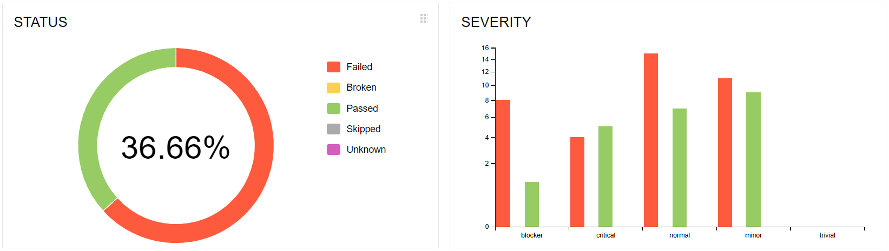
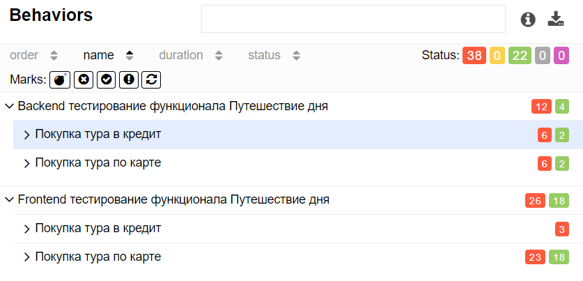

# Отчёт по итогам тестирования

Отчёт по результату автоматизированного тестированию функционала покупки и оформления кредита по данным карты веб-сервиса покупки тура  
"Путешествие дня".

## Количество тест-кейсов

Всего было проведено 60 автотестов. Общий процент успешных тестов равен 36.67%.

Результаты прогона тестов не зависят от типа подключенной БД, поэтому представлен единый отчёт по тестам.

### Результаты тестов по градации серьезности:

### Результаты тестов по тестируемому функционалу:

### Общие итоги:

|                  | Кол-во тестов  | Passed | Failed | Passed, % |
|:-----------------|    :----:   |   :----:   |  :----:   |----------:|
| API тестирование | 16  | 4 | 12 |       25% |
| UI тестирование  | 44  | 18 | 26 |    40.91% |
| Всего            | 60  | 22 | 38 |    36.67% |

В результате прогона тестов было составлено 16 issue. 

## Общие рекомендации

- для увеличения testability SUT рекомендуется добавить элементам страницы атрибут test-id
- необходимо качественная техническая документация по проекту
